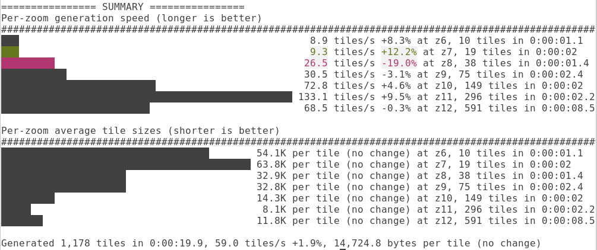

# OpenMapTiles Tools [](https://travis-ci.org/openmaptiles/openmaptiles-tools) [](https://hub.docker.com/r/openmaptiles/openmaptiles-tools) [](https://microbadger.com/images/openmaptiles/openmaptiles-tools)

The OpenMapTiles toolbox for generating TM2Source projects, imposm3 mappings and SQL instructions
from OpenMapTiles layers. We encourage other people to use this for their vector tile projects as well since this approach works well for us.

Check out the [OpenMapTiles project](https://github.com/openmaptiles/openmaptiles/) for a real world example.

## Usage

You need either just Docker or Python 3 installed on your system.  If running without Docker, some of the scripts require `graphviz` and `sqlite3` dependencies.

#### Usage with Docker

The easiest is to use docker directly to run this command. You do not need to clone `openmaptiles-tools` locally, just clone the [openmaptiles repo](https://github.com/openmaptiles/openmaptiles) and run from its root.

_**Note:** container scripts can only access files from the given directory and below, e.g. in this example - `${PWD}` - current dir._
```bash
docker run -it --rm -u $(id -u ${USER}):$(id -g ${USER}) \
           -v "${PWD}:/tileset" \
           openmaptiles/openmaptiles-tools \
           <script-name> <script-parameters>
```

Where the `<script-name>` could be any of the scripts in the [bin/](./bin) directory, e.g. `generate-imposm3 openmaptiles.yaml`.

#### Using without Docker

```bash
# Some tool require these packages. On Debian/Ubuntu you can install them with
sudo apt install graphviz sqlite3

# install the package directly from git
python3 -m pip install git+https://github.com/openmaptiles/openmaptiles-tools

# Run the script you want, e.g. from the openmaptiles dir:
generate-imposm3 openmaptiles.yaml

# If the script doesn't run, make sure your PATH includes default PIP bin directory.
# On Debian/Ubuntu that would be  ~/.local/bin/  (under your home dir).
# Otherwise just run it with  ~/.local/bin/generate-imposm3 ...
```

#### Running from source

Make sure you have all dependencies from the [Usage](#Usage) section above.  You should have the latest Python (3.6+)
```bash
# Get OpenMapTiles layer data
git clone https://github.com/openmaptiles/openmaptiles.git
# Get the tools repo
git clone https://github.com/openmaptiles/openmaptiles-tools.git
# Run scripts from the root of the tools repository
cd openmaptiles-tools
# Install required dependencies (might need to run with sudo
python3.6 -m pip install -r requirements.txt
# The PYTHONPATH=$PWD allows script to find its modules located in the current dir.
PYTHONPATH=$PWD python3 bin/generate-imposm3 ../openmaptiles/openmaptiles.yaml
```

#### Tools Development

Use `make test` to run all of the tests locally.  The Makefile will build a docker image with all the code, run all tests, and compare the build result with the files in the [testdata/expected](./testdata/expected) dir.

Run `make rebuild-expected` after you modify the output produced by the generation scripts. This will re-create the expected test results to match the actual ones, and make sure the changes are what you want. 

## Data Concepts

You define a self contained **Layer** together with SQL files and layer and data source definitions (like an imposm3 mapping file) that you can then reference in a **Tileset** where you mix and match with other layers.


### Define your own Layer

Take a look or copy a standard layer like [building](https://github.com/openmaptiles/openmaptiles/tree/master/layers/building) to get started with your own layer.
A layer consists out of a **Layer** definition written in YAML format.

There you specify the `layer` properties like `id`, `buffer_size` and possible Markdown documentation (`description` and `fields`).
You can also reference SQL files in `schema` for writing the necessary queries for your layer or create generalized tables.
We encourage you to have a function per layer which takes the bounding box and zoom level. This makes it easy
to test and reuse.

If your data is based of OSM you can also directly
reference a [imposm3 mapping file](https://imposm.org/docs/imposm3/latest/mapping.html) to choose the OSM data you need.

```yaml
layer:
  id: "building"
  description: Buildings from OpenStreetMap
  buffer_size: 4
  datasource:
    query: (SELECT geometry FROM layer_building(!bbox!, z(!scale_denominator!))) AS t
  fields:
    render_height: An approximated height from levels and height of building.
    class:
      description: Defines a subclass of a building (one of the known values).
      # Values can be either a list of strings, or a dictionary
      # Dictionary defines mapping of OSM values to the OMT field value
      values:
        school:
          subclass: ['school','kindergarten']
        alcohol_place:
          shop: ['bar']
          subclass: ['alcohol','beverages','wine%']
schema:
  - ./building.sql
datasources:
  - type: imposm3
    mapping_file: ./mapping.yaml
```

For the well known values (enums), the `fields` section can also contain the mapping of the input (OSM) values.
The above example has two output fields - `render_height` and `class`. The `class` field could be one of the predefined
values. An object would have `class=school` if the OSM object has `subclass` either `school` or `kindergarten`.
An object would have `class=alcohol_place` if it either has `shop=bar` or `subclass` having one of the 3 values.

If a layer SQL files contains `%%FIELD_MAPPING: class%%`, `generate-sql` script will replace it

```sql
SELECT CASE
    %%FIELD_MAPPING: class%%
    ELSE NULL
END, ...
```
into
```sql
SELECT CASE
    WHEN "subclass" IN ('school', 'kindergarten') THEN 'school'
    WHEN "shop"='bar'
        OR "subclass" IN ('alcohol','beverages')
        OR "subclass" LIKE 'wine%'
        THEN 'alcohol_place'
    ELSE NULL
END, ...
```

### Define your own Tileset

A **Tileset** defines which layer will be in your vector tile set (`layers`)
and metadata used for generating a TM2Source project to actually generate the vector tiles.

```yaml
tileset:
  layers:
    - layers/building/building.yaml
    - layers/housenumber/housenumber.yaml
    - layers/poi/poi.yaml
  name: Street Level
  description: A tileset showing street level info like building, housenumbers and POIs.
  attribution: "OpenStreetMap contributors"
  maxzoom: 14
  minzoom: 13
  center: [-12.2168, 28.6135, 4]
  bounds: [-180.0,-85.0511,180.0,85.0511]
  pixel_scale: 256
  defaults:
    srs: +proj=merc +a=6378137 +b=6378137 +lat_ts=0.0 +lon_0=0.0 +x_0=0.0 +y_0=0.0 +k=1.0 +units=m +nadgrids=@null +wktext +no_defs +over
    datasource:
      srid: 900913
```

## Testing tiles
### Tile size and PostrgeSQL querying speed
Use `test-perf` to evaluate tile generation performance against a PostgreSQL database.
This utility can test individual layers, several layers at once, as well as the whole tile.
It has several pre-defined testing areas to provide cross-test consistency.
Results are printed as histogram graphs, showing tile size distribution.
The utility can compare current run with a previously saved one, highlighting large changes.
If multiple zoom levels are tested, another histogram shows per-zoom size distribution.
Run with `--help` to see all options.

```
test-perf <tileset> ...
```

Just like `postserve` below, `test-perf` requires PostgreSQL connection.



### Realtime tile server

Postserve is an OpenMapTiles map vector tile test server that dynamically generates metadata and tiles
 directly from PostgreSQL database based on the tileset file definition.

```
postserve <tileset> ...
```

Use `postserve <tileset>` to start serving. Use `--help` to get the list of Postgres connection parameters.
 If you have a full planet database, you may want to use `MIN_ZOOM=6 postserve ...` to avoid accidental slow low-zoom
 tile generation.

#### Postserve quickstart with docker
* clone [openmaptiles repo](https://github.com/openmaptiles/openmaptiles) (`openmaptiles-tools` repo is not needed with docker)
* get a PostgreSQL server running with the openmaptiles-imported OSM data, e.g. by following quickstart guide.
* run `docker pull openmaptiles/openmaptiles-tools` to download the latest tools version
* from inside the openmaptiles repo dir, run this command.
(This assumes PostgreSQL is on the localhost:5432, but if it runs inside docker, you may want to change
 `--net=host` to `--net=openmaptiles_postgres_conn` to match the openmaptiles quickstart, and also expose
  port 8090 to the host with `-p 8090:8090`)
```
docker run -it --rm -u $(id -u ${USER}):$(id -g ${USER}) \
    -v "${PWD}:/tileset" --net=host \
    openmaptiles/openmaptiles-tools \
    postserve openmaptiles.yaml 
```

#### Viewing dynamic tiles
You can view tiles with any MVT-supporting viewer, such as:
* [Maputnik editor](https://maputnik.github.io/editor) (online) -- change the data source to `http://localhost:8090`
* [QGIS desktop](https://www.qgis.org/en/site/) -- add `Vector Tiles Reader` plugin, and add a vector tile server connection with TileJSON URL set to `http://localhost:8090`.


## Scripts

### Generate SQL code to create MVT tiles directly by PostGIS

Uses tileset definition to create a PostgreSQL
 [prepared](https://www.postgresql.org/docs/current/sql-prepare.html) or
 [create function](https://www.postgresql.org/docs/9.1/sql-createfunction.html) SQL code
 to generate an entire vector tile in the Mapbox Vector Tile format with a single `getTile(z,x,y)` query
 using PostGIS MVT support.
 
Use `--help` to get all parameters.

**NOTE:** Current [openmaptiles/postgis](https://github.com/openmaptiles/postgis) image (v2.9 and before) has incorrect
 support for the [ST_AsMVT()](https://postgis.net/docs/ST_AsMVT.html). Until Postgis is updated, please use
 [sophox/postgis docker image](https://hub.docker.com/r/sophox/postgis) (based on the latest
 [mdillon/postgis:11](https://hub.docker.com/r/mdillon/postgis) base image). Another known bug is PostgreSQL JIT could
 make tile generation horribly slow in PG11+, and may need to be disabled.

```
generate-sqltomvt <tileset>
```

### Generate Imposm3 Mapping File

Takes a tileset definition an generates an imposm3 mapping file for importing OSM data.

```
generate-imposm3 <tileset>
```

### Generate SQL scripts

Assembles all SQL referenced in the layer definitions into an SQL script that can be executed with psql.
If `--dir` option  is given, generates `.sql` files that can be executed in parallel.

```
generate-sql <tileset>
generate-sql <tileset> --dir <outputdir>
```

### Generate Markdown Documentation

Takes a tileset definition and generates Markdown documentation.

```
generate-doc <tileset>
```

### Generate ETL (Extract-Transform-Load) graph

dependency:  graphviz

Takes a source code from the imposm3 mapping file and the SQL postprocessing code,
and parsing for the `etldoc:` graphviz based comments, and generate an svg file.
The `.dot` and the `.svg` filename prefix is `etl_`

```
generate-etlgraph <tileset>  <target-directory>
generate-etlgraph layers/landcover/landcover.yaml  ./build/devdoc
generate-etlgraph layers/railway/railway.yaml      ./build/etlgraph
```

example:

input command: `generate-etlgraph layers/landcover/landcover.yaml`
output fies:
- `layers/landcover/etl_landcover.dot`
- `layers/landcover/etl_landcover.svg`


###  Generate SQL query for a given layer and zoom level

example:
```
generate-sqlquery layers/landcover/landcover.yaml  14
```

### Mbtiles file tools
This command allows users to examine and manipulate mbtiles file:
* get, set, and delete individual metadata values
* validate and print all metadata values
* list all tile keys (hashes) that are used many times (usually indicates empty tiles)
* copy zooms, e.g. copy all empty tiles z13 to z14, and create a list of all tiles that needs to be generated.
```
mbtiles-tools --help
mbtiles-tools ./data/tiles.mbtiles meta-all
```

### Add simple metadata to mbtiles file
Updates `metadata` table in the mbtiles file. See [mbtiles-tools](#mbtiles-file-tools) for other tools. 
Example:
```
generate-metadata ./data/tiles.mbtiles
```

### Generate TM2Source Projects for Mapbox Studio Classic

Takes a tileset definition and generates a TM2Source YAML project file.
You need to provide PostgreSQL database connection settings before generating the project.

```
generate-tm2source <tileset> --host="localhost" --port=5432 --database="osm" --user="osm" --password="osm"
```

## Importing into Postgres
The `import-sql` script can execute a single SQL file in Postgres when the file is given as the first parameter.

If ran without any arguments, `import-sql` executes all of the following:
* SQL files from `$OMT_UTIL_DIR`  -  by default contains the [sql/language.sql](./sql/language.sql) script.
* SQL files from `$VT_UTIL_DIR`  - by default contains Mapbox's [postgis-vt-util.sql](https://github.com/mapbox/postgis-vt-util/blob/v1.0.0/postgis-vt-util.sql) helper functions.
* SQL files from `$SQL_DIR`  - defaults to `/sql` -- this volume is empty initially, but should contain build results of running other generation scripts. If this directory contains `parallel/` subdirectory, `import-sql` will assume the parallel/*.sql files are safe to execute in parallel, up to `MAX_PARALLEL_PSQL` at a time (defaults to 5). The script will also execute `run_first.sql` before, and `run_last.sql` after the files in `parallel/` dir (if they exist).

Generating and importing SQL could be done in a single step with `&&`, e.g.

```bash
generate-sqltomvt openmaptiles.yaml > "$SQL_DIR/mvt.sql" && import-sql
```

Optionally you may pass extra arguments to `psql` by using `PSQL_OPTIONS` environment variable. For example `PSQL_OPTIONS=-a` makes psql echo all commands read from a file into stdout.
`PSQL_OPTIONS` allows multiple arguments as well, and understands quotes, e.g. you can pass a whole query as a single argument surrounded by quotes -- `PSQL_OPTIONS="-a -c 'SELECT ...'"`

### Environment variables
Most PostgreSQL-related images support standard PostgreSQL environment variables like `PGUSER`, `PGPASSWORD`, `PGHOST`, `PGDATABASE`, and optionally `PGPORT`.

The only exception is the [`postgis`](./docker/postgis) image, which uses [different variables](https://hub.docker.com/_/postgres/) (`POSTGRES_USER`, `POSTGRES_PASSWORD`, `POSTGRES_HOST`, `POSTGRES_DB`, `POSTGRES_PORT`) during database creation due to how the official Docker postgres image has been set up.


### Performance optimizations
Materialized views can be refreshed in parallel using `refresh-views` command. This could be especially useful if the `CREATE MATERIALIZED VIEW` statements had `WITH NO DATA` clause.
